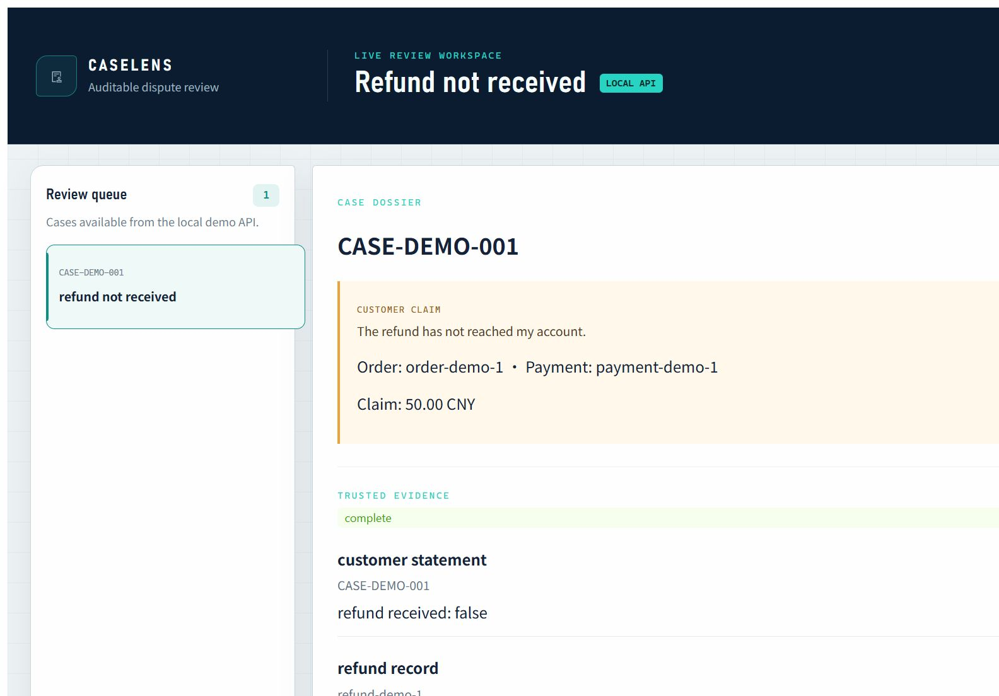
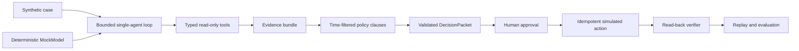

# CaseLens

> **V0.1 · one refund-not-received workflow · synthetic data · reproducible local demo**

CaseLens is an auditable e-commerce dispute review agent and policy regression
lab. It turns a customer claim into traceable evidence, a time-correct policy
citation, a controlled recommendation, and a verified simulated outcome.

CaseLens 是一个可审计的电商争议复核 Agent 与政策回归实验台。

`Python 3.12` · `FastAPI` · `Pydantic` · `SQLAlchemy / SQLite` ·
`React / TypeScript` · `pytest`



[Run the local Demo](#run-the-product-api) ·
[Read the five-minute walkthrough](docs/DEMO.md) ·
[Inspect the evaluation](docs/EVALUATION.md)

## What the Demo proves

- **Investigate:** a bounded single-agent loop can gather traceable evidence
  through typed, read-only business tools.
- **Ground:** the review selects the policy version effective when the dispute
  occurred before retrieving exact clause citations.
- **Control:** a high-risk recommendation stops at a backend-enforced human
  approval gate; an idempotency key protects the simulated action from
  duplicate state changes.
- **Verify and replay:** completion depends on an independent read-back of the
  stored business state, while durable model/tool traces support audit replay.

## How it works



The model can request only registered read-only investigation tools. Policy,
approval, side-effect, idempotency, and verification rules remain deterministic
backend boundaries outside the model.

## Evaluation snapshot

| V0.1 evaluation item | Committed deterministic result |
| --- | --- |
| Dataset | 12 synthetic Golden Cases, 1 dispute type |
| Rules-only | 6/6 applicable cases passed |
| Scripted model-only ablation | 0/6 applicable cases passed |
| Hybrid | 12/12 cases passed |
| Real-model tokens / cost / latency | `not_measured` |

These results are engineering regression checks over authored synthetic cases,
not a production accuracy claim or a statistical generalization result. See the
[methodology and limitations](docs/EVALUATION.md) and the committed
[Markdown report](backend/evals/results/day15-baseline.md).

## Scope and limitations

- V0.1 implements one `refund_not_received` workflow; the other dispute types
  remain planned.
- The case, policy corpus, business records, and Golden Cases are synthetic.
- The Demo uses a deterministic `MockModel` and simulated refund state; a real
  model provider and payment provider are not connected.
- The current deliverable is a reproducible local Demo, not a hosted or
  production-authorized service.
- Real-model quality, repeated-sampling stability, token use, cost, and latency
  have not been measured.

## Core question

How can an agent that operates business tools remain verifiable, reviewable, and replayable when policies change, evidence conflicts, and tools fail?

## Implementation details

<details>
<summary>Expand the implemented engineering boundaries</summary>


- Python 3.12 backend managed with uv.
- Pydantic case model with structured validation.
- Timezone-aware dispute timestamps.
- Deterministic missing-evidence detection for refund records.
- Structured investigation-readiness assessment for refund-not-received cases.
- Auditable fact and evidence records with explicit missing items and conflicts.
- Deterministic evidence status: complete, incomplete, or conflicted.
- Atomic SQLite persistence for cases, evidence snapshots, and investigation
  records through a SQLAlchemy repository.
- Explicit persistence failures for missing records, conflicting identifiers,
  invalid aggregate input, and rolled-back transactions.
- Typed, read-only order, payment/refund, logistics, and message tools backed by
  a replaceable business-data source.
- Explicit distinction between missing business records and source query
  failures; failed reads never become successful empty records.
- A central synchronous dispatcher that turns tool success and expected failure
  paths into one validated result protocol.
- Structured `unknown_tool`, `invalid_input`, `not_found`, `timeout`,
  `source_error`, and safe `internal_error` results with an immutable trace for
  every attempted call.
- Immutable policy versions and deterministic timelines that select the policy
  effective when a dispute occurred, including exact transition boundaries and
  explicit failures for gaps or overlapping versions.
- Time-first, deterministic policy-clause retrieval over a small in-memory
  corpus, with version metadata, effective periods, stable ranking, and exact
  original-text citations.
- Immutable `DecisionDraft` and `DecisionPacket` models with deterministic
  validation of evidence references, policy citations, safe failure paths, and
  high-risk approval requirements.
- A bounded single-agent investigation loop that reuses the model protocol,
  read-only Tool Calling executor, structured Tool Results, model traces, and
  safe maximum-step termination.
- A case-review orchestrator that turns a validated case and read-only
  investigation into auditable evidence, time-aware policy citations, and a
  validated `DecisionPacket`, with safe paths for missing or conflicting
  evidence and policy no-match.
- A durable resolution workflow with packet-bound human approval,
  SQLite-backed simulated refund completion, resource-scoped idempotency, and
  read-back verification before successful completion.
- A versioned FastAPI product boundary for case reads, synchronous review,
  approval, idempotent simulated execution, verification, and aggregate replay
  with model/tool traces.
- Durable full-review snapshots and explicit review-to-resolution lineage, plus
  a deterministic synthetic demo runtime that exercises the real orchestration
  boundaries without calling an external model or payment provider.
- A React and TypeScript review workspace that displays the persisted synthetic case,
  evidence, policy citation, approval gate, execution, verification, and
  durable model/tool trace returned by the product API.
- A deterministic offline evaluation harness with 12 synthetic Golden Cases,
  independent grading, Rules-only, scripted model-only, and Hybrid baselines,
  explicit failure cases, and byte-stable JSON/Markdown reports.
- Automated pytest coverage and Ruff checks.

</details>

## Planned after V0.1

- Deterministic domain models for the remaining three dispute types.
- A real model-provider adapter and repeated-sampling evaluation.
- Broader Golden Cases, CI evaluation gates, and deployment.

## Run the Product API

The default server seeds one clearly synthetic case and uses a deterministic
`MockModel`. It performs no external model or payment-provider calls.

```powershell
cd backend
$env:CASELENS_DB_PATH = "$PWD\caselens-demo.db"
uv sync
uv run uvicorn main:app --reload
```

OpenAPI documentation is available at `http://127.0.0.1:8000/docs`. The API is
versioned under `/api/v1`; the full operation order and example requests are in
the [backend guide](backend/README.md#fastapi-product-api-and-replay).

In a second PowerShell terminal, start the review workspace:

```powershell
cd frontend
npm.cmd ci
npm.cmd run dev
```

Open `http://127.0.0.1:5173`. The complete walkthrough is in the
[five-minute Demo guide](docs/DEMO.md).

## Run the Offline Evaluation

The committed evaluation uses only synthetic data and deterministic mock model
responses. It does not call an external model or payment provider.

```powershell
cd backend
uv run python -m caselens.evaluation
uv run python -m caselens.evaluation --check
```

Read the [evaluation methodology](docs/EVALUATION.md), the
[generated Markdown results](backend/evals/results/day15-baseline.md), or the
[machine-readable JSON](backend/evals/results/day15-baseline.json).

## Run the Current Tests

Requirements:

- Python 3.12
- [uv](https://docs.astral.sh/uv/)

```powershell
cd backend
uv sync
uv run python -m pytest
uv run ruff check .
uv run ruff format --check .
```

```powershell
cd frontend
npm.cmd ci
npm.cmd test -- --run
npm.cmd run lint
npm.cmd run build
```

## Project Documentation

- [Project context](docs/PROJECT_CONTEXT.md)
- [Evaluation methodology and limitations](docs/EVALUATION.md)
- [Five-minute Demo](docs/DEMO.md)

The repository is being developed in small, testable increments. Planned capabilities are not presented as completed features.
